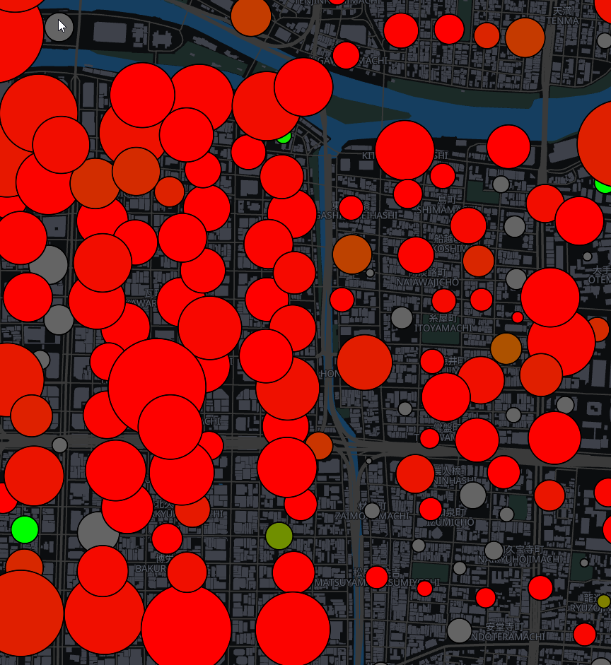
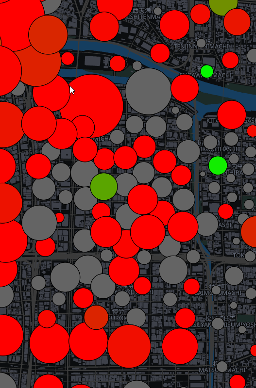
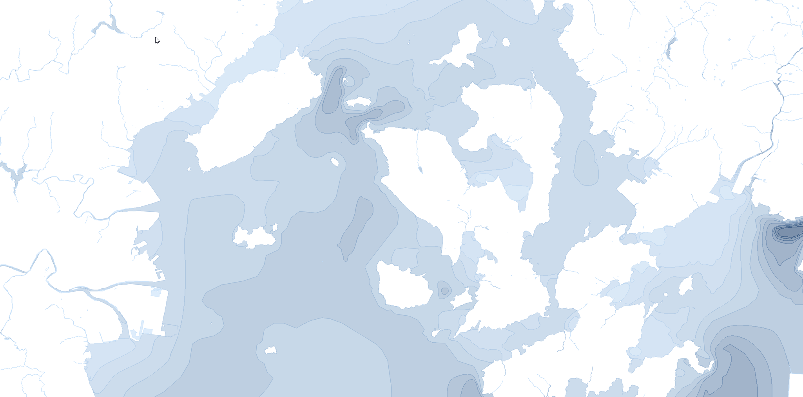
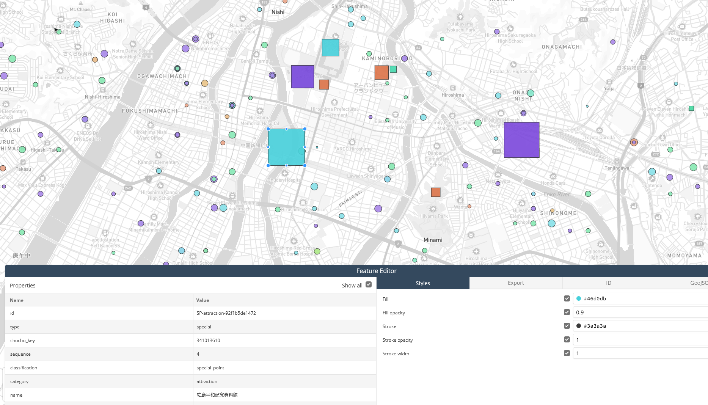

# subwaybuilder-jp-maps

## Summary

Each map covers the metropolitan area (都市圏) around one or more major Japanese cities. Metropolitan-area bounds are taken from the 2015 大都市雇用圏 (Metropolitan Employment Area) dataset (csis.u-tokyo.ac.jp), with adjustments so present-day administrative borders are honored.

## Features

- High level of detail, with sub-250 m population placement in dense areas.
- Spatial realism — points are assigned in a manner that is aware of water features and mesh-weighted density surfaces.
- Special demand from several sources is modeled — covering airports, ports, hospitals, schools and universities, cultural attractions, and military bases. See [Special Demand Details](#special-demand-details) below for the per-category breakdown.
- Buildings are sourced from Overture Maps, with heights back-filled from the Global Building Atlas LoD1 raster.
- OSRM routing is included, with a scaling driving-time penalty based on commute distance and metropolitan-area size.
- Building foundation depth (the clearance a subway tunnel needs to pass beneath a building) is modeled per building from its height and footprint width — low-rise buildings sit at a 10 m minimum and taller, more slender buildings deepen up to an 80 m cap. Freestanding towers (broadcast / observation) and train-related infrastructure are exempt.

## High-Level Methodology

Resident and commuter totals are approximated from employed-persons / workers (就業者数・従業者数) counts per 小地域 (small statistical area), augmented by 500 m (labor) and 250 / 100 m (resident) meshes to achieve sub-小地域 point placement. Population counts per 小地域 are conserved, and point balancing is done through a mesh-aware (population / worker) loss function.

A gravity model augmented with known origin/destination commute patterns by designated-city ward (区) or municipality (市町村) reproduces macro-level commute behaviour in the absence of published sub-municipal O/D pairs.

## Primary Data Sources

- **令和2年国勢調査 (2020 Population Census)** (per-小地域 population, employment, and economic-activity counts) — [e-Stat](https://www.e-stat.go.jp/)
- **令和3年経済センサス (2021 Economic Census)** (per-小地域 workplace and worker counts) — [e-Stat](https://www.e-stat.go.jp/)
- **国土数値情報 (National Land Numerical Information)** (administrative boundaries, coastline, land use, and facility locations) — [国土数値情報 (MLIT)](https://nlftp.mlit.go.jp/)
- **大学ポートレート (University Portraits)** (per-institution higher-education enrollment) — [私学版 (JASSO)](https://www.shigaku.go.jp/) · [国公立版 (NIAD)](https://www.niad.ac.jp/)
- **学校基本調査 (School Basic Survey)** (per-municipality primary and secondary enrollment) — [MEXT](https://www.mext.go.jp/)
- **観光統計 (Tourism Statistics)** (attraction visitor counts, supplemented by prefectural / municipal reports) — [JNTO](https://statistics.jnto.go.jp/)
- **Coastal Bathymetry** (seafloor depth driving the coastal ocean-foundation layer) — [海しる MSIL](https://www.msil.go.jp/) · [J-EGG500 (JODC)](https://www.jodc.go.jp/)
- **令和6年医療施設（動態）調査 (2024 Medical Facility Survey)** (per-facility hospital bed capacity) — [MHLW](https://www.mhlw.go.jp/)
- **Auxiliary Building Footprints** (Overture Maps — the source for the 3D building tiles and ocean-mask polygons) — [Overture Maps Foundation](https://overturemaps.org/)
- **Building Heights** (Global Building Atlas LoD1 per-building height raster) — [GBA (Hugging Face)](https://huggingface.co/datasets/zhu-xlab)
- **Road Network** (OSM road and areal-road geometry) — [OpenStreetMap](https://www.openstreetmap.org/)
- **Routing Network** (OSRM routing shared with the broader Subway Builder map pipeline) — [OSRM Project](http://project-osrm.org/)

## Issues/Questions

Please raise an issue on this repository, or reach out directly on the pack's dedicated [thread](https://discord.com/channels/1420846272545296470/1479686112896356605), for any problems. Suggestions are greatly appreciated and will be accommodated where reasonable.

## Known Issues

- 鹿児島 (Kagoshima) has park data encoded within the ocean, due to the national park surrounding 桜島 (Sakurajima).
- 広島 (Hiroshima) has an improbably tall building — an OSM source error.
- 富山 (Toyama) has a very isolated point deep in the mountains — an algorithm quirk.

## Changelog

### 0.4.0 (2026-07-11)

#### New Cities

- `KHS` - 京阪神 (Keihanshin — the combined 京都 (Kyōto) + 大阪 (Ōsaka) + 神戸 (Kōbe) megaregion)

#### Updated Cities

- `UKB` - 神戸・姫路 (Kōbe & Himeji — now extended west to take in 姫路 (Himeji))
- `SDJ` - 仙台 (Sendai)
- `TOY` - 富山 (Toyama)
- `KIJ` - 新潟 (Niigata)
- `GAJ` - 山形 (Yamagata)

- **Per-building foundation depth.** A building's foundation — the below-ground volume a subway tunnel must clear — is now modeled per building from its height and footprint width rather than a flat default; mid- and high-rise foundations deepen with height and slenderness up to an 80 m cap, while low-rise buildings sit at a 10 m minimum.
  - Freestanding towers (broadcast / observation) are detected by their footprint slenderness and held at the minimum rather than given a deep foundation. This is the first Japanese release with modeled foundations.

- **Refined coastal bathymetry.** Coastal seafloor depth is now modeled from real bathymetric soundings (J-EGG500 and 海しる / MSIL) as a continuous depth gradient rather than a flat shallow floor — depth-banded contours are smoothed and aligned precisely to the coastline, previously-shallow cells over deep water are corrected, and harbours and reclaimed islands are filled in.
  - The ocean-foundation layer (the seafloor a subway tunnel would pass beneath offshore) is rebuilt from the same geometry as the rendered water so the two stay consistent at every zoom.

- **Building heights refined from the Global Building Atlas.** Building heights are now back-filled from the GBA LoD1 raster across the whole fleet — Japanese OSM height tags are sparse, so the maps reworked here gain realistic per-building heights (and therefore per-building foundations and 3D extrusion) for the first time.

- **Fuller land-use coverage.** Parks, forests, farmland, and other greenery are now rendered from OpenStreetMap land use, clipped to water so no greenery paints over rivers, lakes, or coastline, with building footprints subtracted so structures read cleanly against the land-use base.

- **Expanded metropolitan boundaries.** The five updated maps use redrawn metropolitan-area boundaries with fuller commuter-shed coverage — most notably 神戸 (Kōbe), which now extends west to include 姫路 (Himeji).

- **Resident and worker points snap to buildings.** Resident and workplace anchor points now snap to the nearest building footprint, aligning the Japanese maps with the placement approach already used for the European maps and improving realism in dense urban blocks and industrial estates.

- **Updated buildings index.** The buildings index for each map is now packaged in both `.bin` and `.json` formats, to enable compatibility with the most recent versions of the simulation engine; the building-amalgamation pass that shrinks the index on larger maps is also refined to preserve coverage more faithfully.

#### Other Features

- **Removed extraneous tiles layers.** Several base map layers that are not read by the sim have been removed, reducing tile size by roughly 20% across the set of maps.

- **Added compatibility for the bridges/tunnels layer.** The sim now reads a `structure` field on the road output to distinguish bridges and tunnels; the base map layer is encoded to carry that field.

- **Areal roads.** Roads drawn as polygons in OpenStreetMap (pedestrian plazas, platforms, and similar) are now rendered as areal features rather than being dropped.

- **Revised no-signal building height.** Buildings with no usable height signal (untagged in OpenStreetMap and outside the height raster) now fall back to a sensible low-rise default instead of an oversized height that could tower over their neighbours.

- **Cleaner neighborhood labels.** Administrative prefixes (大字 / 字 / 小字) are stripped from 町丁 neighborhood labels so only the salient place name is shown.

### 0.3.8 (2026-04-20)

#### Updated Cities

- `ITM` - 大阪 (Ōsaka)
- `FOKK` - 福北 (Fukuhoku — 福岡 (Fukuoka) + 北九州 (Kitakyūshū))
- `FUK` - 福岡 (Fukuoka)
- `KKJ` - 北九州 (Kitakyūshū)

#### New Features

- **Military base demand.** Personnel are now modeled, with counts estimated from unit composition per base / garrison.
- **Ōsaka (ITM) special-demand + seeding pass.** Full special-demand coverage, improved point seeding, and performance optimization via building aggregation.
- **Fukuoka-area refresh (FOKK / FUK / KKJ).** Improved point seeding carried over from 0.3.7, plus additional special-demand sources.

##### Cross-町丁 repulsion for Ōsaka

### 0.3.7 (2026-04-17)

#### Updated Cities

- `KCZ` - 高知 (Kōchi)
- `MYJ` - 松山 (Matsuyama)
- `OKA` - 沖縄 (Okinawa)
- `SPK` - 札幌 (Sapporo)
- `UKY` - 京都 (Kyōto)

#### New Features

- **Significant rework of all updated maps.** Each now includes attractions-based demand, coastal bathymetry, neighborhood labels, and Overture-sourced buildings.
- **Sapporo (SPK) extent expanded.** Now reaches southeast to 苫小牧 (Tomakomai) and northeast to 岩見沢 (Iwamizawa).
- **Cross-町丁 point seeding.** Initial seeding is now aware of neighbouring-町丁 points, with an added repulsion pass that reduces crowding in dense areas (e.g. central Fukuoka).
- **Elongated-町丁 handling.** 町丁 with high aspect ratios are force-seeded with multiple points so a single point does not stand in for an extreme spatial extent.
- **Building-collision aggregation on larger maps.** Collision boxes are aggregated to reduce index size with minimal loss of coverage.

#### Other Features

- **Consistent ward labeling.** Designated-city ward labels now match the other municipal labels (e.g. 神戸市中央区 / Kōbeshichūōku → 中央区 / Chūō-Ku).

##### Cross-町丁 repulsion

##### Elongated-町丁 handling (before)

##### Elongated-町丁 handling (after)

### 0.3.6 (2026-04-16)

#### New Cities

- `FOKK` - 福北 (Fukuhoku — 福岡 (Fukuoka) + 北九州 (Kitakyūshū))
- `HNA` - 盛岡 (Morioka)
- `KMJ` - 熊本 (Kumamoto)
- `TTJ` - 鳥取 (Tottori)

#### Updated Cities

- `FUK` - 福岡 (Fukuoka)
- `HKD` - 函館 (Hakodate)
- `KKJ` - 北九州 (Kitakyūshū)
- `IZO` - 中海 (Nakaumi)
- `AKJ` - 旭川 (Asahikawa)
- `AOJ` - 津軽 (Tsugaru)
- `FKS` - 中通り (Nakadōri)
- `SHB` - 根室 (Nemuro)
- `WKJ` - 稚内 (Wakkanai)

#### New Features

- **Bathymetry, labels, and Overture buildings across all updated maps.** Older maps (FUK, HKD, KKJ, IZO) received the full rework to include attractions-based demand; newer maps (AKJ, AOJ, FKS) and the test maps (SHB, WKJ) received the bathymetry and Overture buildings on top of their existing attractions demand.
- **Distance- and city-scale-aware routing penalty.** A driving-time penalty is added to OSRM routing to make it less optimistic.
- **Standardized attraction-demand research process.** A consistent method for determining attraction demand (attendance figures, municipal / prefectural reports) is now applied across all maps going forward.

#### Other Features

- **Standard special-demand tagging format.** The repository is integrated with the shared special-demand tagging format.
- **Map description template + preview images.** Now standard for all registry maps.

### 0.3.5 (2026-04-12)

#### New Cities (testing only)

- `SHB` - 根室 (Nemuro)
- `WKJ` - 稚内 (Wakkanai)

### 0.3.4 (2026-04-08)

#### New Features

- **Overture buildings.** Switched to Overture for building generation.
- **Per-tile building / water stitching.** Building and water features are stitched into the pmtiles so rendering is much less taxing at lower zoom.

#### Other Features

- **Nagoya + Ōsaka optimization test.** 名古屋 (Nagoya) and 大阪 (Ōsaka) updated to trial the new optimizations.

### 0.3.3 (2026-04-05)

#### New Cities

- `AKJ` - 旭川 (Asahikawa)
- `AOJ` - 津軽 (Tsugaru — 青森 (Aomori) + 弘前 (Hirosaki))
- `FKS` - 中通り (Nakadōri — 福島 (Fukushima) + 郡山 (Kōriyama))
- `FSZ` - 静岡・浜松 (Shizuoka + Hamamatsu)

#### Updated Cities

- `HIJ` - 広島 (Hiroshima), expanded to include 東広島 + 岩国 (Higashihiroshima + Iwakuni)

#### New Features

- **Custom attraction demand.** Added for major parks, sports venues, and cultural icons, sourced primarily from prefectural / municipal annual reports and censuses.
- **Coastal ocean foundations.** Bathymetric data adds ocean-foundation layers for new and reworked maps.

#### Other Features

- **小地域 vs 500 m mesh worker reconciliation.** Job counts are reconciled against the 500 m job mesh to reduce outliers (e.g. worker concentrations over rice fields). Applied to all new maps and reworks going forward.

##### Bathymetric data

##### Custom attractions

### 0.3.2 (2026-03-27)

#### New Cities

- `NGO` - 名古屋 (Nagoya)

#### Other Features

- **More aggressive demand post-processing.** Demand precision is reduced to shrink overall data size; as a result Ōsaka is also less demanding on the game.

### 0.3.1 (2026-03-25)

#### New Features

- **Reduced Ōsaka buildings index.** Significantly smaller to improve playability and avoid renderer out-of-memory crashes.

#### Other Features

- **More aggressive small-building pruning.** The building-processing filter now more aggressively prunes small multi-polygon buildings.

### 0.3.0 (2026-03-22)

#### New Cities

- `ITM` - 大阪 (Ōsaka)
- `OKJ` - 岡山 (Okayama)

#### New Features

- **University and college demand.** Added for institutions without matching enrollment data.
- **Zoo, aquarium, and botanical-garden demand.** Added across the fleet.

#### Other Features

- **Logarithmic-mean population rebalance.** Overall population is rebalanced to the logarithmic mean of employed-persons / workers for consistency; most cities see a modest increase.
- **Metropolitan-scale demand rebalance.** Per-point min / max demand totals now scale with metropolitan-area size — smaller, less dense areas gain point density, while large dense areas change little.
- **Building-aware point seeding.** Seeding now uses 100 m mesh population estimates to avoid placing resident points where there are no buildings, most apparent in rural areas.
- **Point displacement + agglomeration pass.** A final pass reduces very dense point spacing in urban centers.

#### Bugfixes

- **Corrected O/D origin skew.** Removed the fixed-order origin-point assignment that skewed municipality origins for large destination points, and reduced the share of municipal O/D misalignment sent to the smallest municipalities.

##### Municipal O/D diagram

### 0.2.0 (2026-03-15)

#### New Cities

- `HKD` - 函館 (Hakodate)
- `IZO` - 中海 (Nakaumi — 出雲 (Izumo) + 松江 (Matsue) + 米子 (Yonago))
- `NGS` - 長崎 (Nagasaki)
- `TAK` - 高松 (Takamatsu)
- `TOY` - 富山 (Toyama)

#### New Features

- **Port and hospital demand.** Added across existing maps.
- **Special-demand rebalance.** A rebalancing pass across all existing special-demand types; airports, universities, and high schools receive significant haircuts.
- **Coastline padding.** Added a larger buffer between the coastline and the black off-map tiles.

#### Bugfixes

- **Corrected primary / secondary school demand.** No longer based inadvertently on the municipal class-count fallback; demand now relies on a more accurate under-15 (15歳未満) total per municipality.
- **Restored Kobe building depth.** Fixed the missing building depth on the 神戸 (Kobe) map.

### 0.1.3 (2026-03-09)

#### New Cities

- `KCZ` - 高知 (Kōchi)
- `KIJ` - 新潟 (Niigata)
- `KKJ` - 北九州 (Kitakyūshū)
- `OKA` - 沖縄 (Okinawa)
- `UKY` - 京都 (Kyōto)

#### New Features

- **Neighborhood and city labels.** Added across the fleet.

### 0.1.2 (2026-03-08)

#### New Features

- **Primary / secondary school demand.** Added for primary- and secondary-age students commuting to school.

### 0.1.1 (2026-03-07)

#### Initial Cities

- `FUK` - 福岡 (Fukuoka)
- `GAJ` - 山形 (Yamagata)
- `HIJ` - 広島 (Hiroshima)
- `KOJ` - 鹿児島 (Kagoshima)
- `MYJ` - 松山 (Matsuyama)
- `SDJ` - 仙台 (Sendai)
- `SPK` - 札幌 (Sapporo)
- `UKB` - 神戸 (Kōbe)

## Planned Updates

- Continue reworking older maps to include newer content (attractions, bathymetry, and other cross-cutting features).
- Additional cities not yet covered.

## Special Demand Details

Per-category breakdown of the modeled demand-point categories beyond residence and workplace commute. Each category is geocoded against the relevant authoritative source and sized from operator- or government-published visitor / passenger / enrollment / bed-count figures.

- **Airports**
  - Demand based on annualized passenger statistics, split by international and domestic travelers.
- **Ports**
  - Demand based on annualized passenger statistics.
- **Hospitals**
  - Sized from reported bed capacity combined with known prefectural inpatient bed-usage and outpatient visitation rates.
- **Institutions of Learning**
  - Primary and middle-school students (小学校・中学校), clipped to school districts.
  - High-school students (高等学校), sized by overall municipal enrollment.
  - Post-secondary students (大学・短期大学), sized from real enrollment figures.
- **Cultural Attractions**
  - Attendance figures and candidate sites sourced from prefectural / municipal reports.
  - Zoos, botanical gardens, and aquariums (動物園・植物園・水族館).
  - Art and history museums (美術館・博物館).
  - Parks, sports facilities, and stadiums (公園・運動公園・総合運動公園・スタジアム・競技場).
  - Major shrines, temples, and landmarks (神社・寺・世界遺産・国宝).
- **Military Bases**
  - Personnel modeled from unit composition per garrison / base.

## License

All maps are released under the [GNU General Public License v3.0](https://github.com/ahkimn/subwaybuilder-jp-maps/blob/main/LICENSE).

## Credits

All maps authored by [Yukina-](https://subwaybuildermodded.com/credits/)
