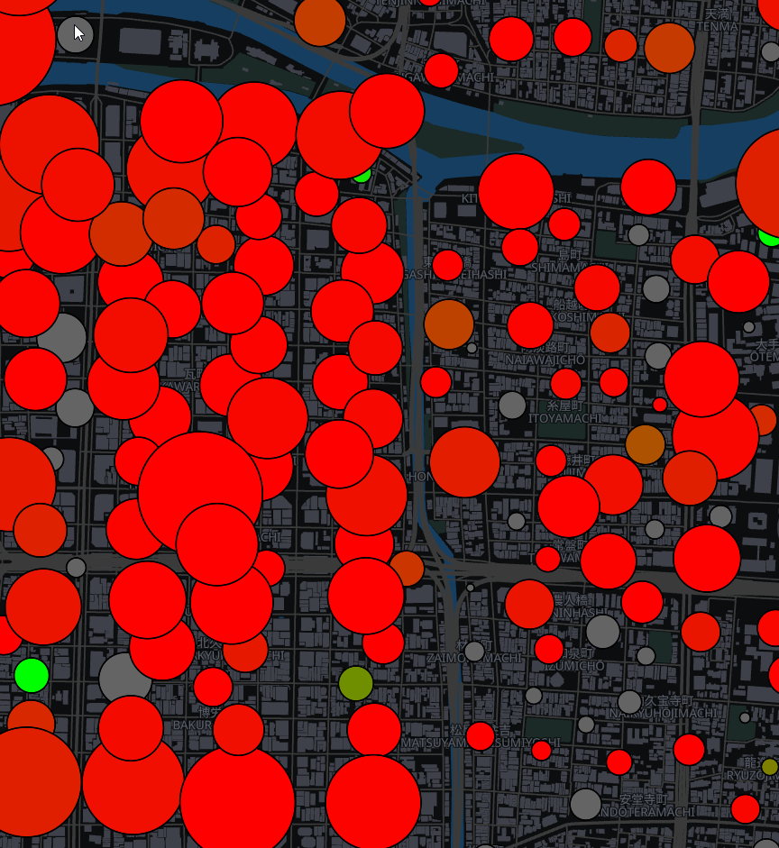
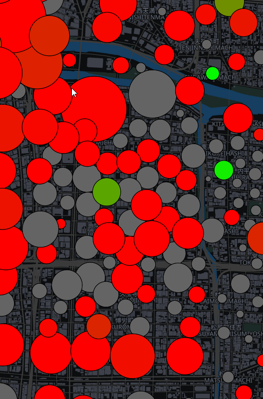
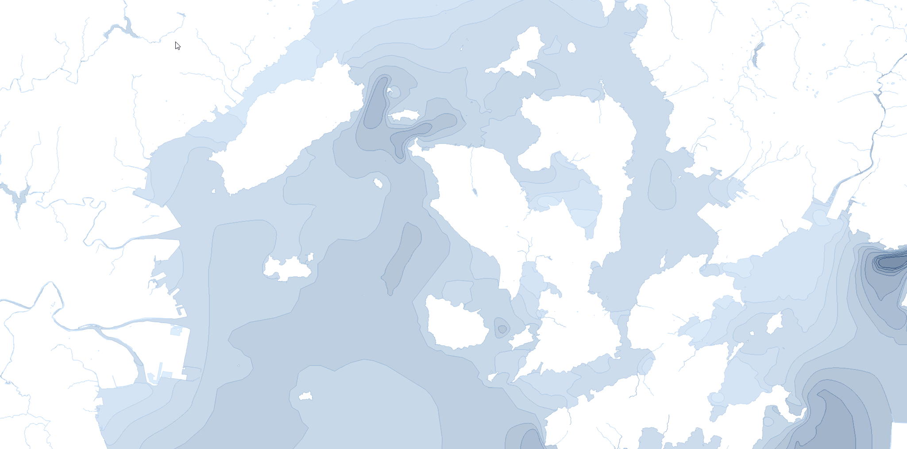
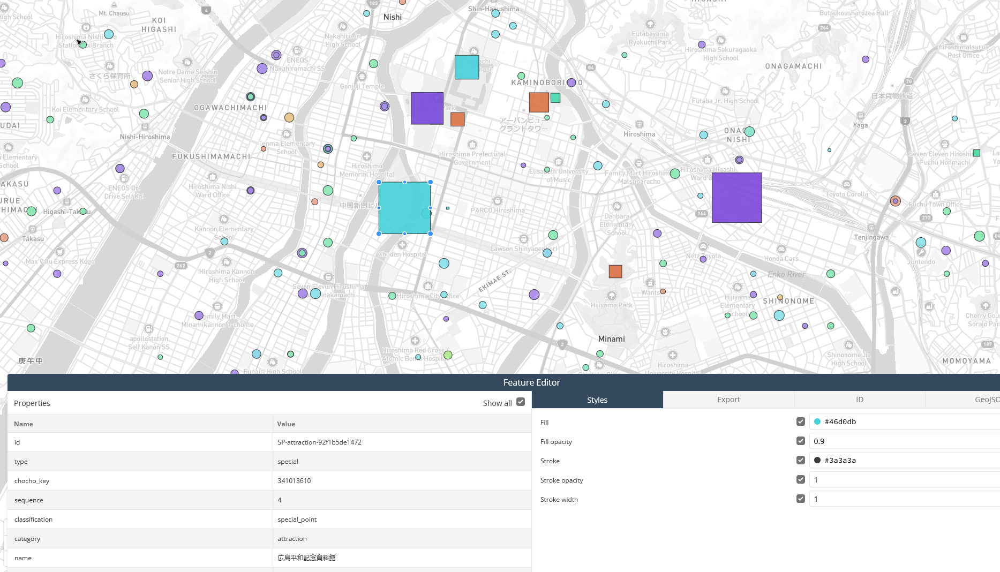

# subwaybuilder-jp-maps

## Summary

Each map covers the metropolitan area (都市圏) around one or more major Japanese cities. Metropolitan-area bounds are taken from the 2015 大都市雇用圏 (Metropolitan Employment Area) dataset (csis.u-tokyo.ac.jp), with adjustments so present-day administrative borders are honored.

## Features

- High level of detail, with sub-250 m population placement in dense areas.
- Spatial realism — points are assigned in a manner that is aware of water features and mesh-weighted density surfaces.
- Special demand from several sources is modeled — covering airports, ports, hospitals, schools and universities, cultural attractions, and military bases. See [Special Demand Details](#special-demand-details) below for the per-category breakdown.
- Buildings are sourced from Overture Maps, with heights back-filled from the Global Building Atlas LoD1 raster.
- OSRM routing is included, with a scaling driving-time penalty based on commute distance and metropolitan-area size.
- Building foundation depth (the clearance a subway tunnel needs to pass beneath a building) is modeled per building from its height and footprint width — low-rise buildings sit at a 10 m minimum and taller, more slender buildings deepen up to an 80 m cap. Freestanding towers (broadcast / observation) and train-related infrastructure are exempt.

## High-Level Methodology

Resident and commuter totals are approximated from employed-persons / workers (就業者数・従業者数) counts per 小地域 (small statistical area), augmented by 500 m (labor) and 250 / 100 m (resident) meshes to achieve sub-小地域 point placement. Population counts per 小地域 are conserved, and point balancing is done through a mesh-aware (population / worker) loss function.

A gravity model augmented with known origin/destination commute patterns by designated-city ward (区) or municipality (市町村) reproduces macro-level commute behaviour in the absence of published sub-municipal O/D pairs.

## Primary Data Sources

- **令和2年国勢調査 (2020 Population Census)** (per-小地域 population, employment, and economic-activity counts) — [e-Stat](https://www.e-stat.go.jp/)
- **令和3年経済センサス (2021 Economic Census)** (per-小地域 workplace and worker counts) — [e-Stat](https://www.e-stat.go.jp/)
- **国土数値情報 (National Land Numerical Information)** (administrative boundaries, coastline, land use, and facility locations) — [国土数値情報 (MLIT)](https://nlftp.mlit.go.jp/)
- **大学ポートレート (University Portraits)** (per-institution higher-education enrollment) — [私学版 (JASSO)](https://www.shigaku.go.jp/) · [国公立版 (NIAD)](https://www.niad.ac.jp/)
- **学校基本調査 (School Basic Survey)** (per-municipality primary and secondary enrollment) — [MEXT](https://www.mext.go.jp/)
- **観光統計 (Tourism Statistics)** (attraction visitor counts, supplemented by prefectural / municipal reports) — [JNTO](https://statistics.jnto.go.jp/)
- **Coastal Bathymetry** (seafloor depth driving the coastal ocean-foundation layer) — [海しる MSIL](https://www.msil.go.jp/) · [J-EGG500 (JODC)](https://www.jodc.go.jp/)
- **令和6年医療施設（動態）調査 (2024 Medical Facility Survey)** (per-facility hospital bed capacity) — [MHLW](https://www.mhlw.go.jp/)
- **Auxiliary Building Footprints** (Overture Maps — the source for the 3D building tiles and ocean-mask polygons) — [Overture Maps Foundation](https://overturemaps.org/)
- **Building Heights** (Global Building Atlas LoD1 per-building height raster) — [GBA (Hugging Face)](https://huggingface.co/datasets/zhu-xlab)
- **Road Network** (OSM road and areal-road geometry) — [OpenStreetMap](https://www.openstreetmap.org/)
- **Routing Network** (OSRM routing shared with the broader Subway Builder map pipeline) — [OSRM Project](http://project-osrm.org/)

## Issues/Questions

Please raise an issue on this repository, or reach out directly on the pack's dedicated [thread](https://discord.com/channels/1420846272545296470/1479686112896356605), for any problems. Suggestions are greatly appreciated and will be accommodated where reasonable.

## Known Issues

- 松山 (Matsuyama) has a patch of flat, uniform sea depth near the far western edge of the map, where detailed depth data is sparse.
- 鹿児島 (Kagoshima) — commuters on the offshore 甑島 (Koshikijima) islands, which are reachable only by ferry, show near-zero commute travel time to the mainland: the routing engine has no ferry connection, so those cross-water trips are not measured. Residents and jobs on the islands are otherwise modeled correctly. A ferry-aware routing backstop is planned.

## Changelog

### 0.4.11 (2026-08-10)

#### New Cities

- `AXT` - 秋田 (Akita)
- `FJN` - 富士・沼津 (Fuji & Numazu)
- `FKJ` - 福井 (Fukui)
- `HHE` - 八戸 (Hachinohe)
- `KFU` - 甲府 (Kōfu)
- `KMI` - 宮崎 (Miyazaki)
- `KMQ` - 金沢 (Kanazawa)
- `MBS` - 前橋 (Maebashi)
- `MMJ` - 松本 (Matsumoto)
- `OIT` - 大分 (Ōita)
- `QFY` - 福山 (Fukuyama)
- `QIS` - 水戸・日立 (Mito & Hitachi)
- `QNG` - 長野 (Nagano)
- `QUT` - 宇都宮 (Utsunomiya)
- `TKS` - 徳島 (Tokushima)
- `UBJ` - 山口 (Yamaguchi)
- `WKY` - 和歌山 (Wakayama)

- **Seventeen new maps join the collection.** This will be the final set of maps for this pack, consisting of prefectural capitals and regional hubs from Tōhoku all the way to Kyūshū. Each is built with the full current modeling pipeline as described in previous Changelog entries.
  - **Cultural and entertainment demand is not complete.** Each map's residential and workplace demand is complete, but the set of special-demand destinations — museums, theme parks, shrines and temples, stadiums, etc. — is incomplete and may be added in a future update.

#### Other Features

- **Regional boundary overlays now ship with the maps.** Maps now include their own municipal (市町村) and neighborhood (大字) boundary data, so the Regions mod can draw administrative regions straight from the installed map with no separate download. This is a packaging addition only; the simulation and its demand modeling are unchanged.
- **Driving routes now load from a companion file.** The per-trip driving-route lines (the polylines that trace each commute) are no longer included within the main demand data. The newest version of Railyard (0.2.10) will enable loads on demand, keeping the demand data that is required in memory lean and serving a route only when it is shown to the user.

### 0.4.10 (2026-08-05)

#### Updated Cities

- `AKJ` - 旭川 (Asahikawa)
- `AOJ` - 津軽 (Tsugaru — 青森 (Aomori) & 弘前 (Hirosaki))
- `FKS` - 中通り (Nakadōri — 福島 (Fukushima) & 郡山 (Kōriyama))
- `FSZ` - 静岡・浜松 (Shizuoka & Hamamatsu)
- `FUK` - 福岡 (Fukuoka)
- `GAJ` - 山形 (Yamagata)
- `HIJ` - 広島 (Hiroshima)
- `HKD` - 函館 (Hakodate)
- `HNA` - 盛岡 (Morioka)
- `IZO` - 中海 (Nakaumi — 出雲 (Izumo) & 松江 (Matsue) & 米子 (Yonago))
- `KCZ` - 高知 (Kōchi)
- `KIJ` - 新潟 (Niigata)
- `KKJ` - 北九州・下関 (Kitakyūshū & Shimonoseki)
- `KMJ` - 熊本 (Kumamoto)
- `KOJ` - 鹿児島 (Kagoshima)
- `MYJ` - 松山 (Matsuyama)
- `NGS` - 長崎 (Nagasaki)
- `OKA` - 沖縄 (Okinawa)
- `OKJ` - 岡山 (Okayama)
- `SDJ` - 仙台 (Sendai)
- `SHB` - 根室 (Nemuro)
- `SPK` - 札幌 (Sapporo)
- `TAK` - 高松 (Takamatsu)
- `TOY` - 富山 (Toyama)
- `TTJ` - 鳥取 (Tottori)
- `UKB` - 神戸・姫路 (Kōbe & Himeji)
- `UKY` - 京都 (Kyōto)
- `WKJ` - 稚内 (Wakkanai)

- **Refreshed onto the modeling improvements introduced in 0.4.9.** These maps adopt the changes made for the five larger maps in the previous release. Commuters are now matched to their workplaces deterministically; the commute totals between districts reproduce the census exactly, and neighboring areas show consistent commute patterns instead of arbitrary block-to-block variation. Each map's geometry is now measured in a projection tuned to its own location, giving more faithful shapes across the map and noticeably smaller map tiles.

- **More even resident and workplace point placement.** The curve that spaces demand points across a map was smoothed to remove a trough at middle densities, so suburban and mid-density neighborhoods no longer appear sparse in demand points.

- **Maps now load at a wider view.** Each map opens zoomed out to show a fuller scale on first load, instead of zoomed in to the immediate area around the population centre.

### 0.4.9 (2026-08-04)

#### Updated Cities

- `NGO` - 名古屋 (Nagoya)
- `ITM` - 大阪 (Ōsaka)
- `KHS` - 京阪神 (Keihanshin — 京都 (Kyōto) & 大阪 (Ōsaka) & 神戸 (Kōbe))
- `FOKK` - 福北 (Fukuhoku — 福岡 (Fukuoka) & 北九州 (Kitakyūshū))

#### New Cities

- `HND` - 東京 (Tōkyō)

- **Reworked how commuters are matched to workplaces.** The previous assignment algorithm drew workplaces as a random sample from the commute model, and attempted to iteratively converge to the measured census matrix. This sometimes left sampling discrepancies in district-to-district commute totals and noticeably different mixes of short- and long-distance commutes in neighboring areas. The algorithm is now now deterministic: it reproduces the census commute totals between districts exactly, and it distributes commute distances evenly across each municipality, so neighboring areas show consistent patterns instead of arbitrary block-to-block variation.

- **More accurate geometry and lighter map tiles.** All JP maps (unlike EU/TW) previously measured their shapes in Web Mercator, which stretches distances and areas at Japan's latitude; each map is now measured in a projection tuned to its own location. The result is a more faithful execution of the tile processing steps, leading to... for the biggest metros especially — noticeably smaller packaged tiles.

- **Trimmed hidden weight from the download.** Building foundations are no longer generated at z=12 where the simulation never draws them, the buildings index now more aggressively prunes small building footprints, and the cosmetic driving-route lines are removed from the demand data for these large metro areas.

- **Maps now load at a wider view.** Each map opens zoomed out to show a fuller scale on first load, instead of zoomed in to the immediate area around the population centre.

- **東京 (Tokyo) is released for the first time.** The full Greater Tokyo metropolis, encompassing parts of seven different prefectures, and covering a region of ~38 million people, joins the collection. It is built with the same commute, workplace, building-height, land-use, and coastal-depth modeling as the other maps.
  - **Cultural and entertainment demand is not yet fully developed.** 東京's residential and workplace demand is complete, but the curated set of special-demand destinations such as museums, theme parks, shrines and temples, stadiums, etc. is not complete.

### 0.4.8 (2026-07-27)

#### Updated Cities

- `NGO` - 名古屋 (Nagoya)

- **Refreshed onto the current modeling pipeline.** 名古屋's first full rebuild since 0.3.4, so the map gains everything introduced across the releases since — per-building foundation depth, Global Building Atlas building heights and 3D extrusion, fuller land-use coverage clipped cleanly to water, Self-Defense Force installation demand, and resident and workplace points snapped to building footprints.

- **Substantially expanded cultural and entertainment demand.** The full special-demand set across the 名古屋 metropolitan area, is rebuilt from prefectural and municipal visitor statistics: cultural attractions, theme parks, shrines and temples, hot-spring towns, stadiums and arenas, and more, each weighted to real visitor counts.

- **Expanded metropolitan boundaries.** The 名古屋 map is redrawn with substantially wider metropolitan extents, extending to include 豊橋市 and its surroundings as well as the capital of 三重県,　津市.

### 0.4.7 (2026-07-26)

#### Updated Cities

- `AOJ` - 津軽 (Tsugaru — 青森 (Aomori) & 弘前 (Hirosaki))
- `FKS` - 中通り (Nakadōri — 福島 (Fukushima) & 郡山 (Kōriyama))
- `HIJ` - 広島 (Hiroshima)
- `HKD` - 函館 (Hakodate)
- `KCZ` - 高知 (Kōchi)
- `MYJ` - 松山 (Matsuyama)
- `NGS` - 長崎 (Nagasaki)
- `SPK` - 札幌 (Sapporo)

- **Corrected military installation placement and workforce.** Self-Defense Force and allied installations that had been positioned from previously approximated coordinates are moved to precise geocoded locations, so each base's demand anchors where it belongs. At the larger US installations — most notably 岩国 (Iwakuni) — the modeled on-base workforce is expanded to reflect full uniformed and civilian staffing rather than the local base-employee (LMO) count alone.

### 0.4.6 (2026-07-26)

#### Updated Cities

- `AKJ` - 旭川 (Asahikawa)
- `FSZ` - 静岡・浜松 (Shizuoka & Hamamatsu)
- `HNA` - 盛岡 (Morioka)
- `KMJ` - 熊本 (Kumamoto)
- `KOJ` - 鹿児島 (Kagoshima)
- `OKA` - 沖縄 (Okinawa)
- `OKJ` - 岡山 (Okayama)
- `TAK` - 高松 (Takamatsu)
- `UKY` - 京都 (Kyōto)

- **Refreshed onto the current modeling pipeline.** This is these maps' first full rebuild since 0.3.x, so each gains everything introduced across the releases since — per-building foundation depth, coastal seafloor depth modeled from real bathymetric soundings, Global Building Atlas building heights and 3D extrusion, fuller land-use coverage clipped cleanly to water, Self-Defense Force installation demand, and resident and workplace points snapped to building footprints.

- **Substantially expanded cultural and entertainment demand.** Each map's full special-demand set — cultural attractions, theme parks, ski resorts, shrines and temples, hot-spring towns, stadiums and arenas, and more — is expanded from prefectural and municipal visitor statistics.

- **Expanded metropolitan boundaries.** 盛岡, 旭川, 鹿児島, and 熊本 are redrawn with substantially wider metropolitan extents and much fuller commuter-shed coverage; 沖縄, 岡山, 高松, and 京都 receive smaller incremental extensions.

### 0.4.5 (2026-07-20)

#### Updated Cities

- `GAJ` - 山形 (Yamagata)
- `KHS` - 京阪神 (Keihanshin — 京都 (Kyōto) & 大阪 (Ōsaka) & 神戸 (Kōbe))
- `KIJ` - 新潟 (Niigata)
- `SDJ` - 仙台 (Sendai)
- `TOY` - 富山 (Toyama)
- `UKB` - 神戸・姫路 (Kōbe & Himeji)

- **Incremental updates, as described in 0.4.4.** These six maps were already brought mostly up to date to the current modeling pipeline in 0.4.3, so they did not need the full rebuild the 0.4.4 cities received. This release simply brings to them the same round of incremental refinements — described in the 0.4.4 changelog below.

### 0.4.4 (2026-07-17)

#### Updated Cities

- `AOJ` - 津軽 (Tsugaru — 青森 (Aomori) & 弘前 (Hirosaki))
- `FKS` - 中通り (Nakadōri — 福島 (Fukushima) & 郡山 (Kōriyama))
- `FOKK` - 福北 (Fukuhoku — 福岡 (Fukuoka) & 北九州 (Kitakyūshū))
- `FUK` - 福岡 (Fukuoka)
- `HIJ` - 広島 (Hiroshima)
- `HKD` - 函館 (Hakodate)
- `ITM` - 大阪 (Ōsaka)
- `IZO` - 中海 (Nakaumi — 出雲 (Izumo) & 松江 (Matsue) & 米子 (Yonago))
- `KCZ` - 高知 (Kōchi)
- `KKJ` - 北九州・下関 (Kitakyūshū & Shimonoseki)
- `MYJ` - 松山 (Matsuyama)
- `NGS` - 長崎 (Nagasaki)
- `SPK` - 札幌 (Sapporo)
- `TTJ` - 鳥取 (Tottori)

- **Refreshed onto the current modeling pipeline.** This release is most of these bundles' first refresh since 0.3.x, so the map gains everything introduced across the releases since — per-building foundation depth, coastal seafloor depth modeled from real bathymetric soundings, Global Building Atlas building heights and 3D extrusion, fuller land-use coverage, Self-Defense Force installation demand, and resident and workplace points snapped to building footprints.

#### Bugfixes

- **Restored coverage of coastal and island 町丁目.** 町丁目 along the 瀬戸内海 and on its islands that have administrative outlines which extend well offshore were previously dropped when the centroid of the boundary fell over water.
  - These 町丁目 are now retained through a municipal mapping, so island villages (e.g. 大崎上島 / 江田島) and the 岩国 waterfront carry their residents and workers.

- **Repaired malformed 町丁目 boundaries.** A few neighborhoods carried self-intersecting boundary data that collapsed them into tiny slivers, cramming their whole population into a fraction of the real area; the outlines are repaired so residents spread across the full neighborhood.

- **Filled missing 町丁目.** A populated stretch of southern 岩国 that the source census omitted entirely is now modeled from the population and worker grids rather than left blank. A similar pattern will be applied to other missing neighborhoods in future releases.

- **Corrected on-base military residents.** Self-Defense Force barracks — most visibly at 呉 — had their entire resident garrison counted as commuting residents; that institutional population is now excluded from the residential total, while the base keeps its then corrected worker and installation demand.

- **Building footprints back-filled from the Global Building Atlas (GBA).** Island and rural neighborhoods where the OpenStreetMap building layer is sparse now draw upon ML footprints from GBA, so demand anchors onto modeled structures instead of collapsing onto a single point.

#### Bugfixes

- **Fixed over-drawn building foundations.** Building foundations were not thinned out at lower zoom levels the way their buildings are, so foundations lingered where the building itself had dropped from view — and the redundant foundations needlessly enlarged the map download. Each foundation is now drawn only where its building is.

### 0.4.3 (2026-07-11)

#### New Cities

- `KHS` - 京阪神 (Keihanshin — 京都 (Kyōto) & 大阪 (Ōsaka) & 神戸 (Kōbe))

#### Updated Cities

- `GAJ` - 山形 (Yamagata)
- `KIJ` - 新潟 (Niigata)
- `SDJ` - 仙台 (Sendai)
- `TOY` - 富山 (Toyama)
- `UKB` - 神戸・姫路 (Kōbe & Himeji — now extended west to take in 姫路 (Himeji))

- **Per-building foundation depth.** A building's foundation — the below-ground volume a subway tunnel must clear — is now modeled per building from its height and footprint width rather than a flat default; mid- and high-rise foundations deepen with height and slenderness up to an 80 m cap, while low-rise buildings sit at a 10 m minimum.
  - Freestanding towers (broadcast / observation) are detected by their footprint slenderness and held at the minimum rather than given a deep foundation. This is the first Japanese release with modeled foundations.

- **Refined coastal bathymetry.** Coastal seafloor depth is now once again modeled from real bathymetric soundings (J-EGG500) as an independently interpolated depth gradient rather than a direct port of the grid-like index — depth-banded contours are smoothed and aligned precisely to the coastline, previously-shallow cells over deep water are corrected, and harbours and reclaimed islands are filled in.
  - The ocean-foundation layer is rebuilt from the same geometry as the rendered water so the two stay consistent at every zoom.

- **Building heights refined from the Global Building Atlas.** Building heights are now back-filled from the GBA LoD1 raster across the whole set of Japanese maps — OSM height tags are sparse, so the maps reworked here gain realistic per-building heights (and therefore per-building foundations and 3D extrusion) for the first time.

- **Fuller land-use coverage.** Additional types of land cover (e.g. wetlands) are now rendered from OpenStreetMap land use, and are now precisely clipped to water so no greenery paints over rivers, lakes, or coastline, with building footprints subtracted so structures read cleanly against the land-use base.

- **Expanded metropolitan boundaries.** The five updated maps use redrawn metropolitan-area boundaries with fuller commuter-shed coverage — most notably 神戸 (Kōbe), which now extends west to include 姫路 (Himeji).

- **Refreshed special-demand coverage.** The five returning maps have their full entertainment related special-demand set — cultural attractions, theme parks, ski resorts, and more — expanded using prefectural and municipal statistics.

- **Military base demand.** Self-Defense Force installations are now modeled as demand points wherever they fall within a map's extent, with personnel estimated from unit composition per base or garrison.

- **Resident and worker points snap to buildings.** Resident and workplace anchor points now snap to the nearest building footprint, aligning the Japanese maps with the placement approach already used for the European maps and improving realism, especially in sparse areas and industrial estates.

- **Updated buildings index.** The buildings index for each map is now packaged in both `.bin` and `.json` formats, to enable compatibility with the most recent versions of the simulation engine; the building-amalgamation pass that shrinks the index on larger maps is also refined to preserve coverage more faithfully.

#### Other Features

- **Removed extraneous tiles layers.** Several base map layers that are not read by the sim have been removed, reducing tile size by roughly 20% across the set of maps.

- **Added compatibility for the bridges/tunnels layer.** The sim now reads a `structure` field on the road output to distinguish bridges and tunnels; the base map layer is encoded to carry that field.

- **Areal roads.** Roads drawn as polygons in OpenStreetMap (pedestrian plazas, platforms, and similar) are now rendered as areal features rather than being dropped.

- **Revised no-signal building height.** Buildings with no usable height signal (untagged in OpenStreetMap and outside the height raster) now fall back to a sensible low-rise default instead of an oversized height that could tower over their neighbours.

- **Cleaner neighborhood labels.** Administrative prefixes (大字 / 字 / 小字) are stripped from 町丁 neighborhood labels so only the salient place name is shown.

### 0.3.8 (2026-04-20)

#### Updated Cities

- `ITM` - 大阪 (Ōsaka)
- `FOKK` - 福北 (Fukuhoku — 福岡 (Fukuoka) & 北九州 (Kitakyūshū))
- `FUK` - 福岡 (Fukuoka)
- `KKJ` - 北九州・下関 (Kitakyūshū & Shimonoseki)

#### New Features

- **Military base demand.** Personnel are now modeled, with counts estimated from unit composition per base / garrison.
- **Ōsaka (ITM) special-demand + seeding pass.** Full special-demand coverage, improved point seeding, and performance optimization via building aggregation.
- **Fukuoka-area refresh (FOKK / FUK / KKJ).** Improved point seeding carried over from 0.3.7, plus additional special-demand sources.

##### Cross-町丁 repulsion for Ōsaka

### 0.3.7 (2026-04-17)

#### Updated Cities

- `KCZ` - 高知 (Kōchi)
- `MYJ` - 松山 (Matsuyama)
- `OKA` - 沖縄 (Okinawa)
- `SPK` - 札幌 (Sapporo)
- `UKY` - 京都 (Kyōto)

#### New Features

- **Significant rework of all updated maps.** Each now includes attractions-based demand, coastal bathymetry, neighborhood labels, and Overture-sourced buildings.
- **Sapporo (SPK) extent expanded.** Now reaches southeast to 苫小牧 (Tomakomai) and northeast to 岩見沢 (Iwamizawa).
- **Cross-町丁 point seeding.** Initial seeding is now aware of neighbouring-町丁 points, with an added repulsion pass that reduces crowding in dense areas (e.g. central Fukuoka).
- **Elongated-町丁 handling.** 町丁 with high aspect ratios are force-seeded with multiple points so a single point does not stand in for an extreme spatial extent.
- **Building-collision aggregation on larger maps.** Collision boxes are aggregated to reduce index size with minimal loss of coverage.

#### Other Features

- **Consistent ward labeling.** Designated-city ward labels now match the other municipal labels (e.g. 神戸市中央区 / Kōbeshichūōku → 中央区 / Chūō-Ku).

##### Cross-町丁 repulsion

##### Elongated-町丁 handling (before)

##### Elongated-町丁 handling (after)

### 0.3.6 (2026-04-16)

#### New Cities

- `FOKK` - 福北 (Fukuhoku — 福岡 (Fukuoka) & 北九州 (Kitakyūshū))
- `HNA` - 盛岡 (Morioka)
- `KMJ` - 熊本 (Kumamoto)
- `TTJ` - 鳥取 (Tottori)

#### Updated Cities

- `FUK` - 福岡 (Fukuoka)
- `HKD` - 函館 (Hakodate)
- `KKJ` - 北九州・下関 (Kitakyūshū & Shimonoseki)
- `IZO` - 中海 (Nakaumi)
- `AKJ` - 旭川 (Asahikawa)
- `AOJ` - 津軽 (Tsugaru)
- `FKS` - 中通り (Nakadōri)
- `SHB` - 根室 (Nemuro)
- `WKJ` - 稚内 (Wakkanai)

#### New Features

- **Bathymetry, labels, and Overture buildings across all updated maps.** Older maps (FUK, HKD, KKJ, IZO) received the full rework to include attractions-based demand; newer maps (AKJ, AOJ, FKS) and the test maps (SHB, WKJ) received the bathymetry and Overture buildings on top of their existing attractions demand.
- **Distance- and city-scale-aware routing penalty.** A driving-time penalty is added to OSRM routing to make it less optimistic.
- **Standardized attraction-demand research process.** A consistent method for determining attraction demand (attendance figures, municipal / prefectural reports) is now applied across all maps going forward.

#### Other Features

- **Standard special-demand tagging format.** The repository is integrated with the shared special-demand tagging format.
- **Map description template + preview images.** Now standard for all registry maps.

### 0.3.5 (2026-04-12)

#### New Cities (testing only)

- `SHB` - 根室 (Nemuro)
- `WKJ` - 稚内 (Wakkanai)

### 0.3.4 (2026-04-08)

#### New Features

- **Overture buildings.** Switched to Overture for building generation.
- **Per-tile building / water stitching.** Building and water features are stitched into the pmtiles so rendering is much less taxing at lower zoom.

#### Other Features

- **Nagoya + Ōsaka optimization test.** 名古屋 (Nagoya) and 大阪 (Ōsaka) updated to trial the new optimizations.

### 0.3.3 (2026-04-05)

#### New Cities

- `AKJ` - 旭川 (Asahikawa)
- `AOJ` - 津軽 (Tsugaru — 青森 (Aomori) & 弘前 (Hirosaki))
- `FKS` - 中通り (Nakadōri — 福島 (Fukushima) & 郡山 (Kōriyama))
- `FSZ` - 静岡・浜松 (Shizuoka & Hamamatsu)

#### Updated Cities

- `HIJ` - 広島 (Hiroshima), expanded to include 東広島 + 岩国 (Higashihiroshima + Iwakuni)

#### New Features

- **Custom attraction demand.** Added for major parks, sports venues, and cultural icons, sourced primarily from prefectural / municipal annual reports and censuses.
- **Coastal ocean foundations.** Bathymetric data adds ocean-foundation layers for new and reworked maps.

#### Other Features

- **小地域 vs 500 m mesh worker reconciliation.** Job counts are reconciled against the 500 m job mesh to reduce outliers (e.g. worker concentrations over rice fields). Applied to all new maps and reworks going forward.

##### Bathymetric data

##### Custom attractions

### 0.3.2 (2026-03-27)

#### New Cities

- `NGO` - 名古屋 (Nagoya)

#### Other Features

- **More aggressive demand post-processing.** Demand precision is reduced to shrink overall data size; as a result Ōsaka is also less demanding on the game.

### 0.3.1 (2026-03-25)

#### New Features

- **Reduced Ōsaka buildings index.** Significantly smaller to improve playability and avoid renderer out-of-memory crashes.

#### Other Features

- **More aggressive small-building pruning.** The building-processing filter now more aggressively prunes small multi-polygon buildings.

### 0.3.0 (2026-03-22)

#### New Cities

- `ITM` - 大阪 (Ōsaka)
- `OKJ` - 岡山 (Okayama)

#### New Features

- **University and college demand.** Added for institutions without matching enrollment data.
- **Zoo, aquarium, and botanical-garden demand.** Added across the fleet.

#### Other Features

- **Logarithmic-mean population rebalance.** Overall population is rebalanced to the logarithmic mean of employed-persons / workers for consistency; most cities see a modest increase.
- **Metropolitan-scale demand rebalance.** Per-point min / max demand totals now scale with metropolitan-area size — smaller, less dense areas gain point density, while large dense areas change little.
- **Building-aware point seeding.** Seeding now uses 100 m mesh population estimates to avoid placing resident points where there are no buildings, most apparent in rural areas.
- **Point displacement + agglomeration pass.** A final pass reduces very dense point spacing in urban centers.

#### Bugfixes

- **Corrected O/D origin skew.** Removed the fixed-order origin-point assignment that skewed municipality origins for large destination points, and reduced the share of municipal O/D misalignment sent to the smallest municipalities.

##### Municipal O/D diagram

### 0.2.0 (2026-03-15)

#### New Cities

- `HKD` - 函館 (Hakodate)
- `IZO` - 中海 (Nakaumi — 出雲 (Izumo) & 松江 (Matsue) & 米子 (Yonago))
- `NGS` - 長崎 (Nagasaki)
- `TAK` - 高松 (Takamatsu)
- `TOY` - 富山 (Toyama)

#### New Features

- **Port and hospital demand.** Added across existing maps.
- **Special-demand rebalance.** A rebalancing pass across all existing special-demand types; airports, universities, and high schools receive significant haircuts.
- **Coastline padding.** Added a larger buffer between the coastline and the black off-map tiles.

#### Bugfixes

- **Corrected primary / secondary school demand.** No longer based inadvertently on the municipal class-count fallback; demand now relies on a more accurate under-15 (15歳未満) total per municipality.
- **Restored Kobe building depth.** Fixed the missing building depth on the 神戸 (Kobe) map.

### 0.1.3 (2026-03-09)

#### New Cities

- `KCZ` - 高知 (Kōchi)
- `KIJ` - 新潟 (Niigata)
- `KKJ` - 北九州・下関 (Kitakyūshū & Shimonoseki)
- `OKA` - 沖縄 (Okinawa)
- `UKY` - 京都 (Kyōto)

#### New Features

- **Neighborhood and city labels.** Added across the fleet.

### 0.1.2 (2026-03-08)

#### New Features

- **Primary / secondary school demand.** Added for primary- and secondary-age students commuting to school.

### 0.1.1 (2026-03-07)

#### Initial Cities

- `FUK` - 福岡 (Fukuoka)
- `GAJ` - 山形 (Yamagata)
- `HIJ` - 広島 (Hiroshima)
- `KOJ` - 鹿児島 (Kagoshima)
- `MYJ` - 松山 (Matsuyama)
- `SDJ` - 仙台 (Sendai)
- `SPK` - 札幌 (Sapporo)
- `UKB` - 神戸 (Kōbe)

## Planned Updates

- Continue reworking older maps to include newer content (attractions, bathymetry, and other cross-cutting features).
- Additional cities not yet covered.

## Special Demand Details

Per-category breakdown of the modeled demand-point categories beyond residence and workplace commute. Each category is geocoded against the relevant authoritative source and sized from operator- or government-published visitor / passenger / enrollment / bed-count figures.

- **Airports**
  - Demand based on annualized passenger statistics, split by international and domestic travelers.
- **Ports**
  - Demand based on annualized passenger statistics.
- **Hospitals**
  - Sized from reported bed capacity combined with known prefectural inpatient bed-usage and outpatient visitation rates.
- **Institutions of Learning**
  - Primary and middle-school students (小学校・中学校), clipped to school districts.
  - High-school students (高等学校), sized by overall municipal enrollment.
  - Post-secondary students (大学・短期大学), sized from real enrollment figures.
- **Cultural Attractions**
  - Attendance figures and candidate sites sourced from prefectural / municipal reports.
  - Zoos, botanical gardens, and aquariums (動物園・植物園・水族館).
  - Art and history museums (美術館・博物館).
  - Parks, sports facilities, and stadiums (公園・運動公園・総合運動公園・スタジアム・競技場).
  - Major shrines, temples, and landmarks (神社・寺・世界遺産・国宝).
- **Military Bases**
  - Personnel modeled from unit composition per garrison / base.

## License

All maps are released under the [GNU General Public License v3.0](https://github.com/ahkimn/subwaybuilder-jp-maps/blob/main/LICENSE).

## Credits

All maps authored by [Yukina-](https://subwaybuildermodded.com/credits/)
